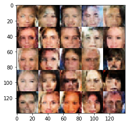

# Deep Convolution Generative Adversarial Network generate face

+ Implemented a `Deep Convolution GAN` model to generate face picture based ` CelebA` dataset
+ In `generator network`, used `transposed convolutions` to upsample from the input layers; applied `leaky ReLu` as activation function; applied `batch normalization` to help network train faster and reduce problems due to poor parameter initalization
+ In `discriminator network`, built `convolutional` classifer and applied `leaky ReLu` and `batch normalization`; used one `fully connected` layer and got sigmoid output
+ Calculated losses for discriminator and generator by using `sigmoid cross entropys`; applied label `smoothing` to help discriminator generalize better
+ Used `AdamOptimizer` and created an optimizer for each network that update the network variables separately

