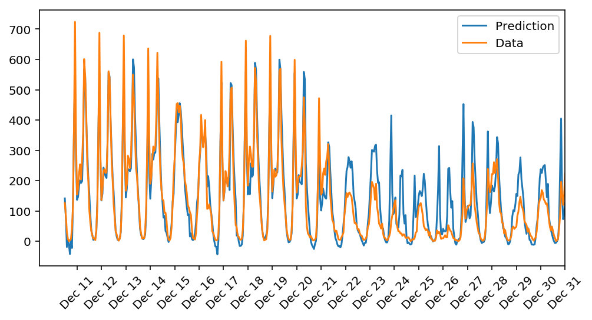
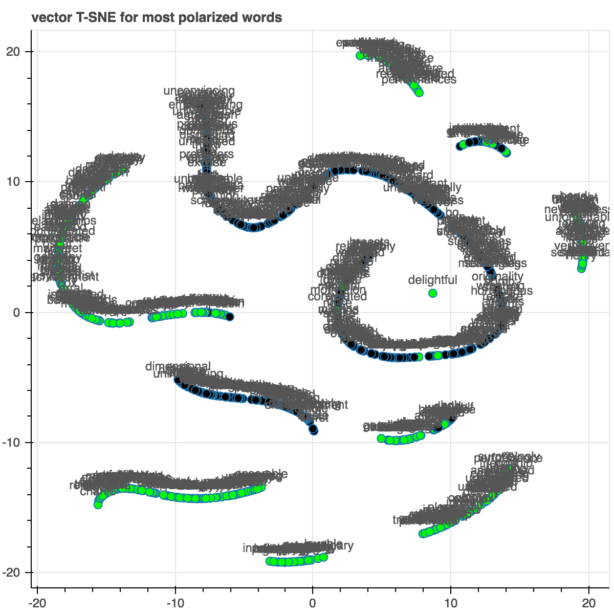
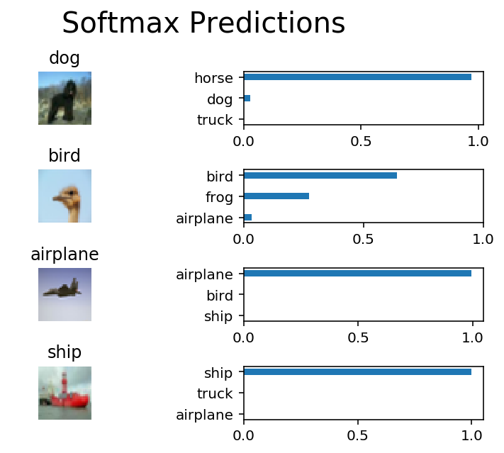

# deep learning

- [x] Bike Rental Ridership Prediction

- [x] Sentiment Classification

- [x] CNN images classification

- [x] RNN Generate TV Script
- [x] Language Translation through RNN
- [x] Deep Convolution Generative Adversarial Network generate face

---
> Udacity Deep Learning Foundation Nanodegree