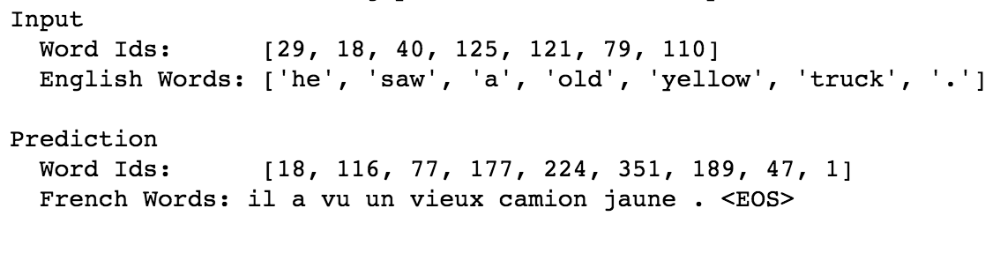

# language translation through RNN

+ Implemented a `sequence to sequence` model, to translate English sentence to French in real time
+ Created an `encoder` RNN layer by using two layers of `LSTM` cell with `dropout`
+ Implemented a encoder to embed the data into sequence and pass data into encoder RNN layer
+ Built an `embedding` layer and used that layer as a loopup table
+ Implemented `training decoder` layer and `inference decoder` layer with shared weights and biases
+ Used `fully-connected` layer for output

---

